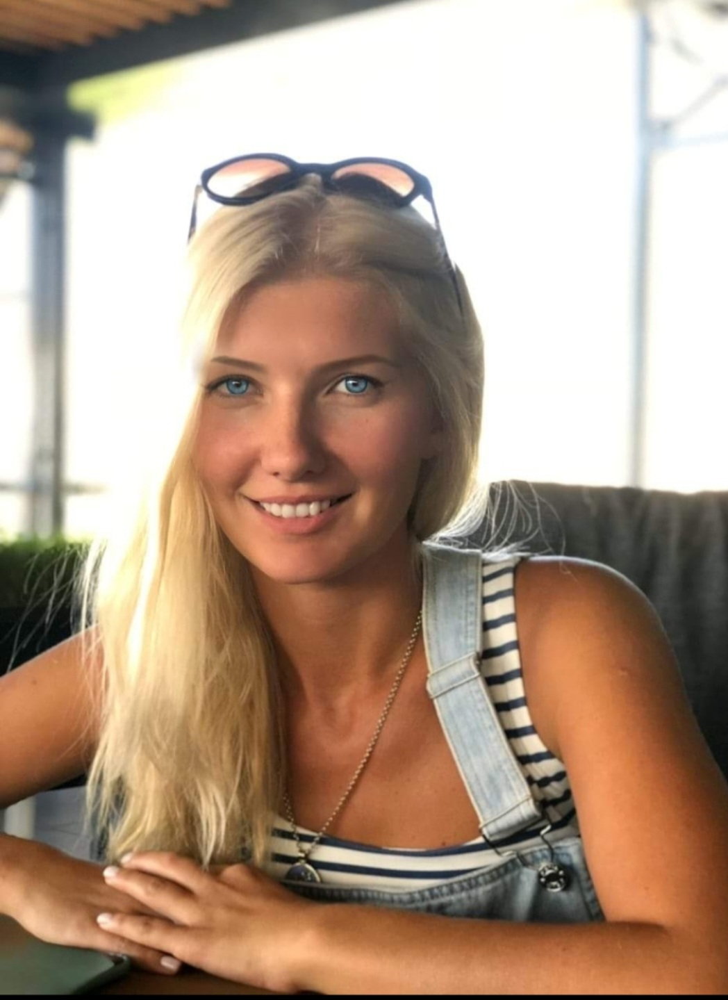

# Hello World :hand: 
 *** 

- My name is Viktoriya, I come from Ukraine, but now I live in *Germany*, in beautiful city *Dusseldorf*. In my background I was a lawer, but when I came to Germany I have understand, that it is hard to work here with my aducation and my knowledge in German language.:disappointed_relieved: I decided to change my work and start to learn smth new.:smiley: And now I am studying web development with DCI. :nerd_face:

***
## My interests and hobby

Here I want to say a little about my interests.	:wink: I like to travel and to learn another people. I like learning new skills and recently I have been interested in exploring different languages as they help me explore new cultures around the world. I started learning German :smile: and I have already cleared B2 level. I generally spend my weekends focusing on exploring new German words and watching German movies to strengthen my grasp over the language. Also I like:
- Sports:mag_right::ice_skate::golf:
- Reading :book::blue_book:
- Cooking:fried_shrimp:	:fish_cake::green_salad:
- Traveling :world_map: :beach_umbrella:

***
